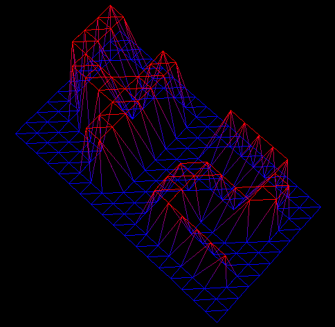

FdF
===

Disclaimer
----------
> In School 42, almost every project must be written according to a coding syntax standard (also known as "[Norme](./docs/norme.fr.pdf)").
>
> That's why some parts may be strange

About
-----
>Now let's discover something more exciting: how to open a graphic window and draw in? To begin your journey in the country of graphic programming, FdF proposes to represent the mesh in "wire of a field" in 3D.

This is the first project in the Computer Graphic branch at School 42 Paris.

The goal is to generate a wireframe model from a set of vertex.

Here's how it looks like:



*Kind of cool isn't it ?*

I wrote a little 3D graphic engine thanks to the minilibx.

>Note: Why is it called *FdF* ? Well FdF stand for *Fil de Fer* in French which litteraly means *Iron wire*
*The more you know...*

Installation
------------

Simply run `make -C Fdf/ fclean && make -C Fdf/`

Right now this build is only compatible with macOS Sierra... but I've included a minilibx version for OS X El Capitan

then run `mv FdF/minilibx FdF/minilibx_S && mv FdF/minilibx_C FdF/minilibx && make -C Fdf/ fclean && make -C Fdf/`

the OS X El Capitan version of minilibx work on macOS Sierra but generate warning during compilation

Usage
-----
`./fdf map.fdf`
* A `.fdf` file is a set of vertice like this one:
```
0  0  0  0  0  0  0  0  0  0  0  0  0  0  0  0  0  0  0
0  0  0  0  0  0  0  0  0  0  0  0  0  0  0  0  0  0  0
0  0 10 10  0  0 10 10  0  0  0 10 10 10 10 10  0  0  0
0  0 10 10  0  0 10 10  0  0  0  0  0  0  0 10 10  0  0
0  0 10 10  0  0 10 10  0  0  0  0  0  0  0 10 10  0  0
0  0 10 10 10 10 10 10  0  0  0  0 10 10 10 10  0  0  0
0  0  0 10 10 10 10 10  0  0  0 10 10  0  0  0  0  0  0
0  0  0  0  0  0 10 10  0  0  0 10 10  0  0  0  0  0  0
0  0  0  0  0  0 10 10  0  0  0 10 10 10 10 10 10  0  0
0  0  0  0  0  0  0  0  0  0  0  0  0  0  0  0  0  0  0
0  0  0  0  0  0  0  0  0  0  0  0  0  0  0  0  0  0  0
```

* You can find many `.fdf` files in the `resources/` directory

* The following key are used to move the camera:
    * `I`, `K` : Rotate along the X-axis
    * `J`, `L` : Rotate along the Y-axis
    * `O`, `P` : Rotate along the Z-axis
    * `A`, `D` : Translate along the X-axis
    * `W`, `S` : Translate along the Y-axis
    * `+`, `-` : Translate along the Z-axis (Numerical Pad)

##### Project done in 2017
